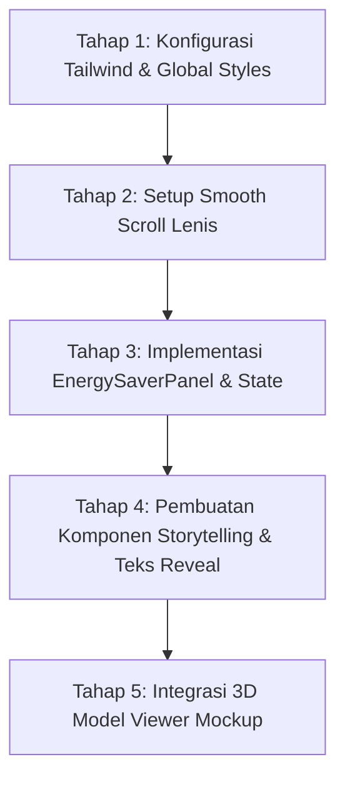

# Rencana Integrasi Desain Premium (Noho.ink Style) pada nasaq.id

Dokumen ini berisi rencana komprehensif untuk mengadopsi estetika desain premium, interaksi, dan fitur hemat energi dari **noho.ink** ke dalam proyek **nasaq.id** (`/mnt/dracarys99/projects/my-portfolio`). Integrasi ini tetap mempertahankan stack teknologi aktif saat ini (Next.js 16, React 19, Tailwind CSS v4, dan Framer Motion).

---

## 🎨 1. Sistem Desain & Estetika (Visual Language)

Noho.ink mengandalkan tata letak yang bersih, tipografi yang kontras, efek glassmorphism, dan transisi mikro yang terasa organik. Kita akan mengadopsinya menggunakan utility classes dari **Tailwind CSS v4**.

### A. Tipografi & Skala Font
*   **Font Utama**: Gunakan font modern dari Google Fonts seperti `Outfit` atau `Plus Jakarta Sans` untuk heading, dan `Inter` untuk body text.
*   **Scale**: Gunakan skala yang kontras antara judul halaman besar dengan teks deskripsi kecil.
    *   `h1`: Ukuran besar (`text-5xl md:text-7xl font-light tracking-tight`).
    *   `descriptor`: Teks pelengkap berukuran kecil tetapi tebal (`text-xs font-semibold uppercase tracking-wider`).

### B. Glassmorphism & Palet Warna
*   **Latar Belakang**: Latar belakang minimalis dengan gradasi lembut (soft gradient) di dark/light mode.
*   **Efek Transparansi**: Menggunakan filter blur untuk header dan panel mengambang.
    *   Tailwind v4: `bg-neutral-900/50 backdrop-blur-md border border-neutral-800/50` (Dark) dan `bg-white/50 backdrop-blur-md border border-neutral-200/50` (Light).

### C. Transisi Halaman & Smooth Scroll
*   Integrasikan **Lenis Scroll** (menggunakan `@studio-freight/react-lenis` atau instansiasi Lenis manual di layout utama) agar navigasi halaman terasa mulus.
*   Gunakan helper `components/PageTransition.tsx` yang sudah ada untuk menganimasi keluar-masuk konten halaman dengan Framer Motion.

---

## 🛠️ 2. Fitur & Komponen Utama yang Akan Dibuat

### Komponen A: `EnergySaverPanel` (Fitur Eco-Friendly)
Panel kontrol interaktif di header yang memungkinkan pengguna meminimalkan konsumsi daya baterai dan penggunaan memori.

*   **Fungsi**:
    1.  **Dark Mode Toggle**: Diintegrasikan dengan `next-themes` untuk mengubah tema ke gelap demi menghemat daya layar OLED/AMOLED.
    2.  **Reduce Motion Toggle**: Jika aktif, akan memicu state global `reduceMotion: true` yang menonaktifkan semua animasi masuk (ScrollReveal/TextReveal) demi menghemat CPU/GPU.
*   **Indikator Header**: Menampilkan badge dinamis:
    *   🟢 **Energy usage: Low** (jika Dark Mode & Reduce Motion aktif).
    *   🟡 **Energy usage: Med** (jika salah satu aktif).
    *   🔴 **Energy usage: High** (jika keduanya tidak aktif).

### Komponen B: `StorytellingSection` (Naratif Studi Kasus)
Desain teks mengalir di mana kata-kata kunci memicu tampilan media/tangkapan layar di sebelahnya atau memicu visual inline.

*   **Mekanisme**:
    *   Teks naratif studi kasus memiliki kata-kata bergaris bawah tipis.
    *   Hover atau scroll pada kata tersebut akan memicu pembaruan gambar *before/after* pembuktian di panel visual pendamping secara instan (menggunakan Framer Motion layout transitions).

### Komponen C: `Android3DViewer` (Showcase Interaktif Mockup)
Menggantikan showcase gambar statis dengan visualisasi mockup handphone Android 3D interaktif.

*   **Teknologi**: Menggunakan Google `<model-viewer>` yang di-load secara dinamis (lazy load) di sisi klien.
*   **Fitur**:
    *   Pengguna dapat memutar handphone 3D untuk melihat desain aplikasi dari berbagai sudut.
    *   Tombol kontrol di UI memungkinkan penggantian gambar screenshot yang diproyeksikan pada layar handphone 3D secara dinamis.

---

## 📋 3. Langkah Implementasi (Tahapan Refactoring)

### Tahap 1: Konfigurasi Tailwind & Global Styles
1.  Tambahkan variabel CSS khusus di `app/globals.css` untuk transisi transparan, efek glassmorphism, dan variabel warna adaptif.
2.  Pastikan konfigurasi Tailwind CSS v4 mendukung animasi reduksi secara global menggunakan media query `@media (prefers-reduced-motion)`.

### Tahap 2: Integrasi Lenis untuk Smooth Scroll
1.  Buat file `contexts/ScrollProvider.tsx` untuk menginisialisasi Lenis Scroll.
2.  Bungkus layout utama (`app/(dashboard)/layout.tsx`) dengan `ScrollProvider`.

### Tahap 3: Pembuatan `EnergySaverPanel`
1.  Buat state global/context `contexts/EnergySaverContext.tsx` untuk melacak preferensi `reduceMotion`.
2.  Buat komponen `components/layout/EnergySaverPanel.tsx` dan integrasikan dengan `Header.tsx`.
3.  Ubah komponen animasi (`ScrollReveal.tsx` dan `TextReveal.tsx`) agar membaca nilai `reduceMotion` sebelum memicu efek Framer Motion.

### Tahap 4: Merancang Halaman Utama & Storytelling
1.  Terapkan tipografi kontras tinggi pada `components/sections/HeroSection.tsx`.
2.  Buat bagian portfolio dengan pendekatan naratif menggunakan layout inline image dan transisi halus.

### Tahap 5: Integrasi `<model-viewer>` 3D
1.  Simpan model 3D perangkat (misal: smartphone format `.glb`) di folder `public/assets/models/`.
2.  Buat komponen `components/ui/Android3DViewer.tsx` yang hanya dirender di sisi client (`next/dynamic` dengan `{ ssr: false }`).
3.  Hubungkan kontrol UI warna/screenshot dengan properti `<model-viewer>`.

---

## 🧪 4. Rencana Pengujian (Verification Plan)

### A. Pengujian Fungsional & Kinerja
*   **Animasi Redundant**: Pastikan ketika *Reduce Motion* aktif, seluruh komponen `ScrollReveal` dan `TextReveal` langsung mematikan animasinya dan langsung menampilkan konten secara instan tanpa jeda.
*   **Performa 3D**: Gunakan Lighthouse audit untuk memastikan pemuatan `<model-viewer>` secara dinamis tidak mengorbankan metrik Largest Contentful Paint (LCP) pada mobile.
*   **Kompatibilitas Layar**: Uji responsivitas mockup 3D dan tata letak teks di berbagai ukuran viewport (Desktop, Tablet, Mobile).

### B. Pengujian Aksesibilas (a11y)
*   Pastikan switch kontrol hemat daya memiliki tag `aria-label` yang jelas dan dapat diakses menggunakan navigasi keyboard.
*   Gunakan kontras warna teks yang memadai saat beralih antara dark mode dan light mode.
